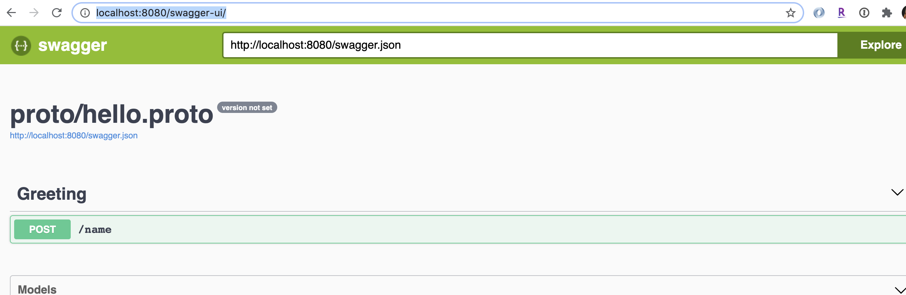

## gPRC

gPRC is a modern open source high performance RPC framework that can run in any environment. 
It can efficiently connect services in and across data centers with pluggable support for 
load balancing, tracing, health checking and authentication. 
It is also applicable in last mile of distributed computing to connect devices, mobile applications 
and browsers to backend services. For more info about gRPC, please refer to: https://grpc.io/

gPRC is awesome. However, it does not have a UI interface for us to interact with, which is the huge 
drawback of gRPC. Fortunately, grpc-gateway allows us to interact with gPRC like how we interact with 
HTTP. 

## grpc-gateway
The grpc-gateway is a plugin of the Google protocol buffers compiler protoc. 
It reads protobuf service definitions and generates a reverse-proxy server which translates a 
RESTful HTTP API into gRPC. 
This server is generated according to the google.api.http annotations in your service definitions.
For more information about grpc-gateway, please refer to : https://github.com/grpc-ecosystem/grpc-gateway

## grpc with swagger UI
SwaggerUI is an open source project to visually render documentation for an API and allows users interact 
with API much more easily. For more information about swagger, please refer to: https://swagger.io/

## Combination of gPRC with HTTP and swaggerUI
In this repo, I collected gRPC, gRPC-gatewat and swagger UI to make them work together. I mostly followed this example:
https://grpc-ecosystem.github.io/grpc-gateway/

### Prerequisite
- This repo uses Python 3.7 or even high Python version.
- This repo uses Go for reverse proxy, so make sure you have Go installed. If you do not have Go installed
  in your local, pleasae go to https://golang.org/doc/install and make sure you set up your $GOPATH and $GOBIN
  properly

### Installation
- make sure you are in ``api/`` directory
- run ``pip install -r requirements.txt``

### Start the server
If you have this repo downloaded in your local, you can just do ``make all`` and then go to http://localhost:8080/swagger-ui/
You should be able to see the swaggerUI showed up. 

 |

### Details of make all
``make all`` downloads all the required go package and generate necessary server. 
